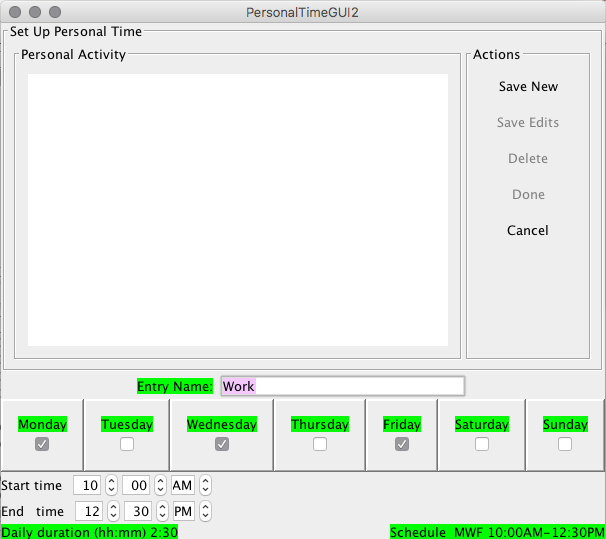

# How to Add Personal Time
While at university, your personal time can be filled with many different activities. This "**adding personal time**" tab is dedicated to all of the extracurricular activities that you will take on during spare time. Simply make a list of every activity outside of class ,such as **organizational events*, *study time*, *church*, *work**, and any _planned outings with friends_. These are all eligible to be placed in this tab. Once you have created your list, it is now time to add your personal time to your schedule by completing the following steps:
1. Place activity in **"Entry Name"**
2. **Check** the boxes for the days the activity takes place
3. Select the **"Start Time"** and **"End Time"**
4. Once finished, click **"Save New"**
5. Press **"Done"** when all events are added
