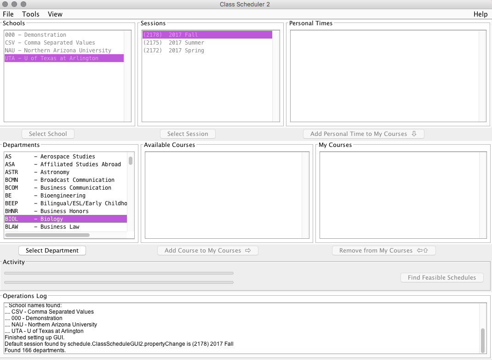

# How to Select Course Departments
For every course you take at the _University of Texas at Arlington_, each one has a corresponding department and course number. Your assigned academic advisor is responsible for informing you of which courses to take, such as BIOL 2457. For this section of making your personal schedule, we are going to focus on selecting the appropriate department for a designated course, or BIOL as in the example. 
1. Locate Department Name for needed course
2. Click **"Select Department"** 
3. Repeat steps **1** and **2** for **each** course
