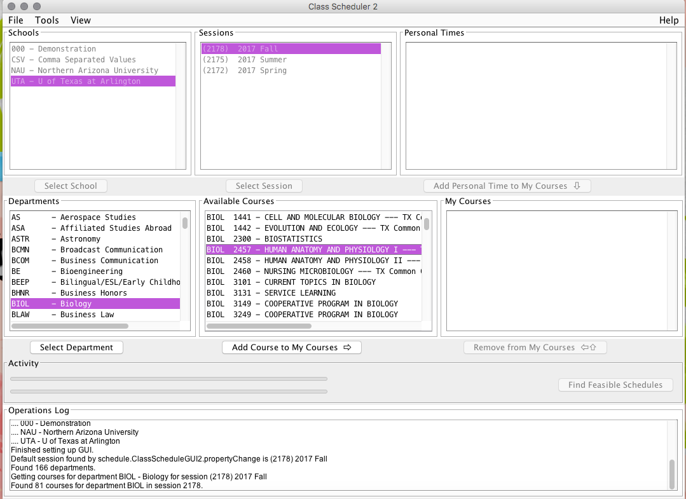

# How to Add Course to Scheduler
Now that your department for the course has been selected, the screen will now display all the classes offered for the selected department. Now, we are going to locate the corresponding course number associated with the class you need to enroll in. In this example, we use BIOL 2457. 
1. Search for the appropiate number needed. 
2. Once you select the correct course, press "**Add Course to My Courses**."
3. **Repeat** steps *1* and *2* for each course
 
