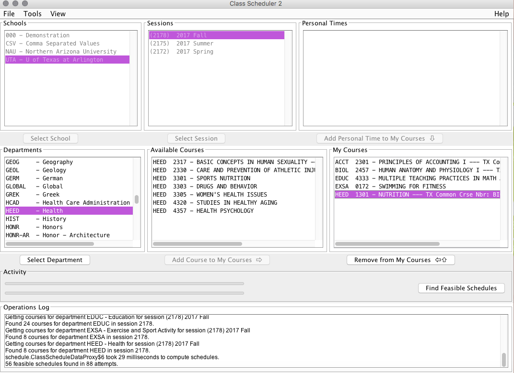

# Removing Courses
Let's face it, we all make mistakes! In the case where you add the incorrect course, these simple steps will guide you to remove it. 
1. Click the **incorrect** course
2. Select **Remove from My courses**
