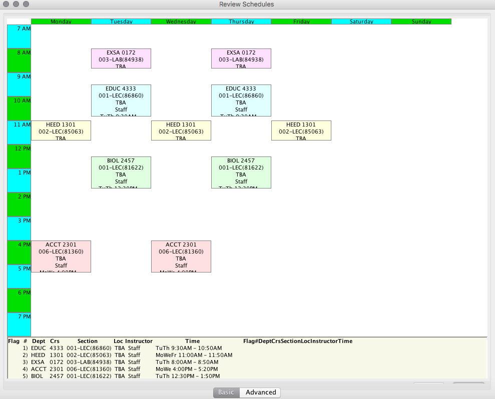

# Before continuing... 

* For our instructions and user guide to make the most sense, we recommend accessing this page **_after_** you have **read** and **completed** the steps on the [Introduction to ClassScheduler](11-Introduction%20to%20ClassScheduler) page and in the [Using ClassScheduler to Make a Personal Scheduler](2-Using%20ClassScheduler%20to%20Make%20a%20Personal%20Schedule) folder.

* This page serves as a **guide** for what our viewers should see as a final product when making their schedule. Additionally, we offer _common problems_ that students may face when creating their schedule through this program. 

## Final Product and Troubleshooting FAQ

 
Once you have completed all of the steps provided, your final schedule should look **similar** to this, varying based on the personal time you added and the courses you have selected. However, we know that with most technology... there are going to be some technical issues that arise; no matter how hard we try to _prevent_ them. So, we have developed a common "troubleshooting" page for you to refer to when you experience a technical issue.

* #### Q: I am unable to edit my personal time. What should I do? 
* #### Q: I accidentally closed out of the ClassScheduler program, and now, all of my selected coursework is gone. Is there an option to save a schedule?
* #### Q: There was not a "feasible schedule" with my selected personal time and selected courses. What do I need to do? 
* #### Q: How can I personalize my schedule, like the introduction says?

