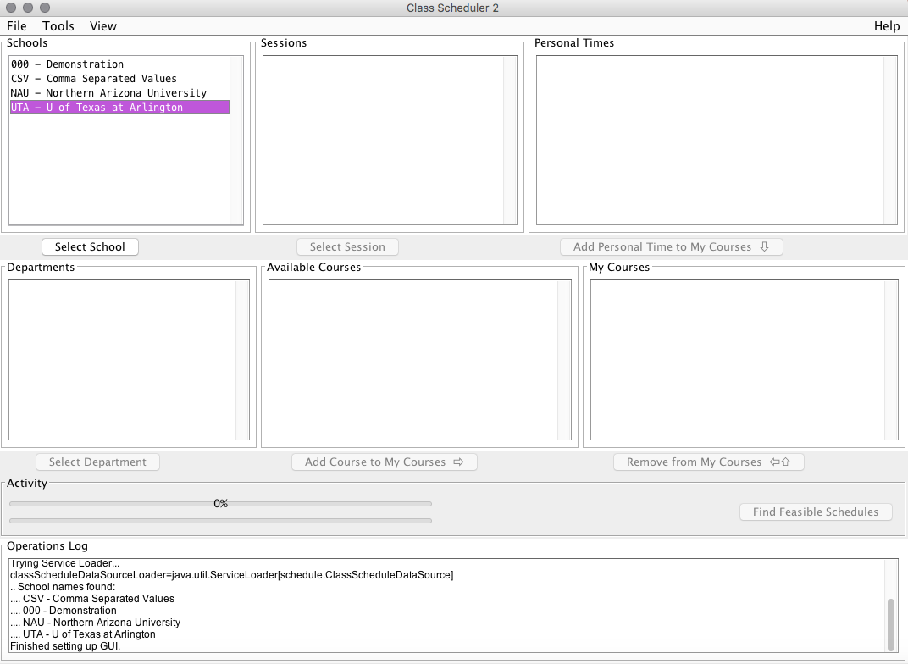

The first step to creating the perfect scheduler for your busy schedule, is to choose your school! To begin, choose the school that you are committed to attending. In this example, you see that the University of Texas at Arlington is highlighted. When you have selected the school, it will appear like so. Once the school is chosen, then click "select school".
