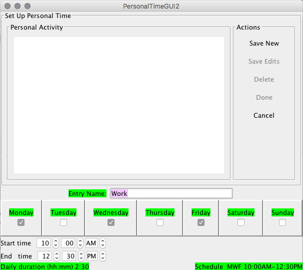

While at university, your personal time can be filled with many differnt activities. This "adding personal time" tab is dedicated to all of the extracurricular activities that you will take on during spare time. Simply make a list of every activity outside of class such as, organizational events, study time, church, and any planned outings with friends. These are all eligible to placed in this tab. Once you have created your list, simply press the "adding personal time" tab. 
