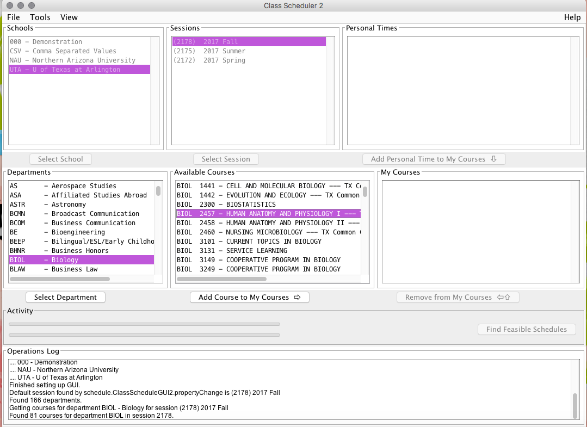

Now that your department for the course has been selected, it the screen will now displlay all the classes offered for the selected department. For example, if your department is BIO, courses starting with BIO 101 to the highest level offered that semester will appear. Search for the appropiate number needed. Once you selct the correct course, press "Add course to My courses". 
If you add a wrong class, you may simply click on the course and press "Remove from My Courses". 
