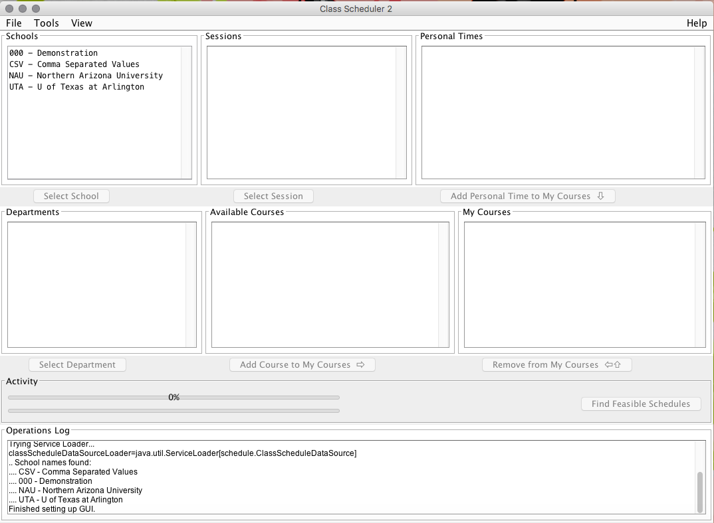

#What is _ClassScheduler_?

An issue most college students suffer from is balancing and properly managing time for school, work, sleep, and socialization. Time management is an imperative skill for students to learn while in college; so, that their adult and work lives have a greater chance of staying properly balanced. Fortunately for students at the University of Texas at Arlington, the program ClassScheduler is available to all who wish to use it. ClassScheduler is a program that utilizes plug-ins from a university’s website to help students enter their course load for the semester and decrease the chances of a student overbooking his or herself. After a student has entered their class schedule, the program blocks off any free time that a student may want to use for socialization, napping, homework, or work. In addition to blocking off free time, the program works to ensure that there are no scheduling conflicts that interfere with the course schedule already set in place within the program.

Also, students have the option of personally designing their schedule so that they are visually satisfied while viewing their schedule. Previous users of ClassScheduler have stated that they preferred their own design over what their school had to offer. If students at the University of Texas at Arlington are having any issues with the ClassScheduler program, then they have the option of following our simple how-to instructions on operating the program. Our instructions provide guidance in the following categories: Selecting School, Selecting Department, Selecting Session, Adding Courses, Removing Courses, Adding Personal Time, and Finding Feasible Schedules. 

